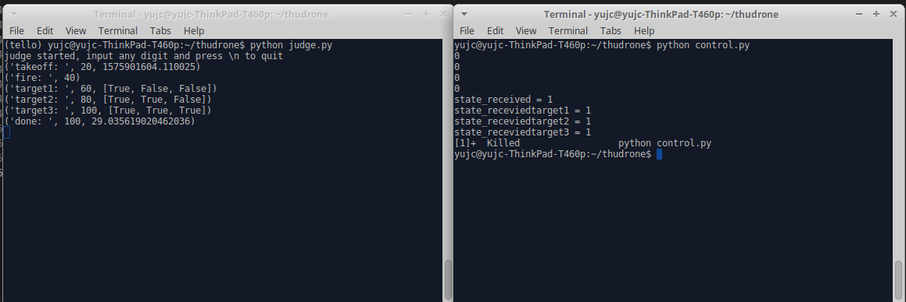

# 上位机模拟程序和无人机与上位机交互例程

## 选手通信协议

这是比赛选手本地可以运行的裁判模拟器，主要有以下功能：

- 读取`/groupid/takeoff` 话题的消息 
  - 话题的内容是0或者1，1表示无人机准备完毕，请求起飞
- 读到请求信号后，，向`/groupid/received`话题发送起飞准许
  - 如果当前是当前正在比赛的组别，话题内容是1，score+=10，开始计时
  - 假如不是，发送0
- 向`/groupid/target1`发送第一个要找的目标,为0-4中的一个，
  - 在`/groupid/takeoff`收到之后开始发送
  - 同上，还有`/groupid/target2`和`/groupid/target3`的任务目标发布，
- 读取`/groupid/seenfire` 话题
  - 内容是0或者1 ，1表示无人机已经成功穿过着火点
  - score+=20
- 读取`/groupid/seentarget1` 话题，
  - 内容是柜子的id，也就是数字1-5，
  - 判断与系统存储的数字是否一致，
    - 如果一致，score+=20，
      - 向`/groupid/receivedtarget1` 话题发送1，表示已经收到，可以向下进行
    - 如果接收到的结果和系统存储的数字不一致，
      - 向 `/groupid/failure` 发送1，表示任务失败。
      - 结束计时，可以自行降落
- 同上，还有`/groupid/seentarget2`和`/groupid/seentarget3`，注意必须先匹配1然后再匹配2和3，识别是有顺序的。
- 读取`/groupid/done`话题,收到1表示无人机成功完成任务，已经降落，score+=10，结束计时。


## 文件组织

该项目中有两个文件，judge.py 和 control.py

其中 judge.py 为本地的上位机模拟器。control.py 为整体与上位机交互流程。同学们可以参考 control.py 的写法在自己的程序中添加上位机交互代码。

待检测的三个物体由布置场地的过程中通知选手，建议选手预留可配置接口。根据场地布置结果修改目标物体。

## judge.py

新建终端，直接运行 

```Shell
    python judge.py
```

在本地新建了一个上位机裁判逻辑终端。可以通过修改 judge.py 第9行， GROUP_INDEX 变更小组编号。

要退出模拟器终端很简单，在终端中输入数字，回车即可退出。

judge.py 第12行：```aim_objs = [0,3,4]``` 代表需要找的物体对应的编号为 0(猫)，3（小孩），4（煤气罐）

ID对应的是 ['cat','painting','files','baby','gas tank']

judge.py 第13行： ```targets = [3,4,5]``` 代表目标的三个物体所在柜子的编号。 第一个物体在3号柜子上，第二个物体在4号柜子上，第三个物体在5号柜子上。


## control.py

control.py 是一个例子程序，表示了流程。

新建终端，直接运行。（需要在启动 judge.py 之后运行）

```Shell
    python control.py
```

control.py 23到83行，是接收上位机的数据。并更新全局变量。

control.py 84到165 行，利用全局变量，给出了一个全流程与裁判机交互的例子。

## 使用

先在终端A（左侧）运行 judge.py。再在终端B（右侧）运行 control.py。 
可以看到contrl.py与judge.py 的交互过程。

运行结果如下图


